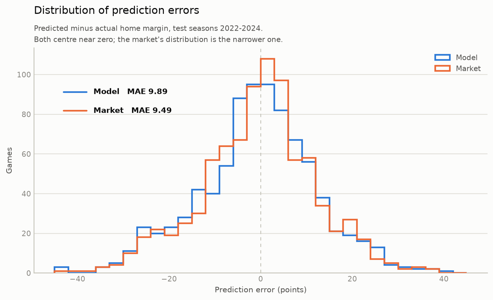
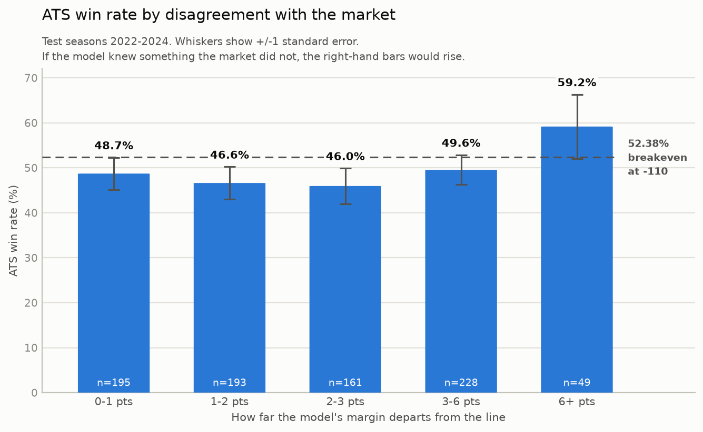
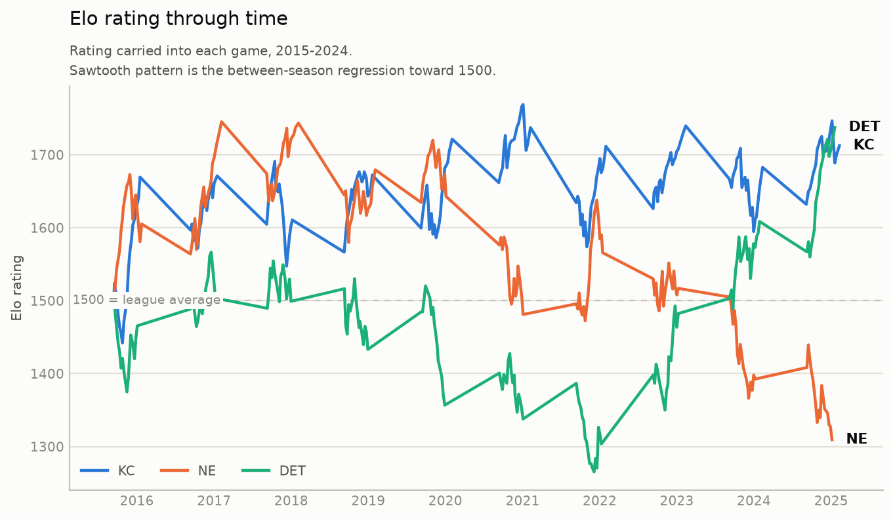

# NFL Elo Margin Model — v1

An Elo rating system for NFL teams that predicts the **point margin** of each game,
backtested chronologically with no look-ahead, and measured against the market
point spread.

> **v1 is complete.** The rating system, the backtest, the accuracy and
> against-the-spread evaluations, and the plots are all done. A feature-based
> regression layer is v2. See [Status](#status) and [Roadmap](#roadmap).

**Headline result: the model does not beat the market, and it is not close.**
Against the spread it went **401-425-28 (48.55%)** on held-out seasons, versus the
**52.38%** needed to break even at -110 odds. That is not a marginal miss — it is
below a coin flip, and a coin flip loses money at these prices. Details in
[Results](#against-the-spread).

---

## Motivation

The point of this project is not to build a profitable betting model. It is to run
a quant-style exercise honestly, end to end:

1. **Estimate an outcome** from first principles — here, a team rating system that
   knows nothing except who played whom and what the score was.
2. **Compare the estimate against an efficient market price** — the market point
   spread, which already incorporates injuries, weather, rest, travel, coaching,
   and the weight of money.
3. **Assess the edge truthfully**, including the very likely finding that there
   isn't one.

The betting market is a genuinely hard benchmark. A model that lands close to it
using only scores is an interesting result; a model that appears to beat it is
usually a model with a leak. The design priority throughout is therefore
**correctness of the evaluation**, not the size of the headline number.

---

## Status

| Component | State |
|---|---|
| Data loading and verification | Complete |
| Elo rating system (prediction + update) | Complete |
| Chronological no-look-ahead backtest | Complete |
| Margin accuracy + straight-up evaluation | Complete |
| Train-only parameter tuning | Complete (home-field advantage) |
| Against-the-spread (ATS) evaluation | Complete |
| Plots | Complete |

---

## Quick start

```bash
python3 -m venv .venv
.venv/bin/pip install -r requirements.txt

.venv/bin/python backtest.py    # run the backtest, print final team ratings
.venv/bin/python evaluate.py    # accuracy metrics vs the market baseline
.venv/bin/python tune.py        # home-field advantage sweep (train seasons only)
.venv/bin/python plots.py       # regenerate the figures below into plots/
.venv/bin/python test_update.py # unit checks on the Elo update rule
```

Game data downloads automatically on first run and is cached in `data/`
(git-ignored). No API keys, no accounts.

---

## Data

**Source:** [nflverse/nfldata](https://github.com/nflverse/nfldata) —
[`data/games.csv`](https://github.com/nflverse/nfldata/blob/master/data/games.csv)

Chosen because it carries **results and market spreads in the same table**, so no
join between a scores source and an odds source is required. Mismatched team
abbreviations and dates across two sources is one of the most common ways a sports
backtest breaks silently, and this removes that class of bug entirely.

**Coverage used:** 2015–2024, **2743 games** (2623 regular season, 120 playoff).
Spread coverage is 100% with no nulls in any column the model reads.

Verified before building on it:

- `result` equals `home_score - away_score` on all 2743 games, exactly.
- `spread_line` is **positive when the home team is favored** — the opposite of
  standard betting notation, and confirmed in the nflverse docs: *"This lines up
  with the `result` column."* It is therefore directly comparable to the model's
  predicted home margin, with no sign flipping.
- 9 games ended in ties; 74 landed exactly on the spread.

**Known limitation:** the nflverse documentation specifies the sign convention but
does **not** state whether `spread_line` is an opening, consensus, or closing line.
Any ATS result from this project should be described as beating (or not beating)
*the nflverse spread line*, not specifically *the closing line*.

### Data handling decisions

**Relocated franchises are treated as one team.** Three franchises moved during the
window and nflverse assigns them new codes: `STL`→`LA` (2016), `SD`→`LAC` (2017),
`OAK`→`LV` (2020). Left unmapped, the model would treat the 2015 Rams and 2016 Rams
as unrelated teams and reset one to the base rating mid-backtest. It is the same
roster, coaching staff and front office, so the codes are merged, yielding 32 teams.
Season carryover already expresses "teams change year to year" in a principled way;
letting relocation act as a second, ad-hoc reset would double-count that for three
arbitrary teams.

**Neutral sites are detected by the `location` column, not by game type.** There are
**53** neutral-site games in the window — 42 regular-season international games plus
the Super Bowls — and all of them have home-field advantage zeroed.

---

## Methodology

### Ratings and prediction

Every team starts at 1500. A single number — the home-adjusted rating difference —
carries the model's entire view of a matchup:

```
rating_diff = (home_rating + home_field_advantage) - away_rating
```

That difference is then read two different ways, for two different purposes:

| Function | Formula | Used for |
|---|---|---|
| `expected_score` | `1 / (1 + 10 ** (-diff / 400))` | inside the update rule |
| `predicted_margin` | `diff / 25` | evaluation and spread comparison |

**Why one is a logistic and the other is linear.** `expected_score` predicts a
*bounded* game outcome (1 win / 0.5 tie / 0 loss), so it needs an S-curve.
`predicted_margin` predicts an *unbounded* point margin, and the empirical
relationship between rating gap and average margin is close to a straight line. The
linear form's known weakness is at the extremes — it will cheerfully predict a
30-point margin where reality compresses, because favorites rest starters and coast
with a lead. Those matchups are rare enough that v1 accepts it.

### The update rule

```
shift = K * mov_multiplier * (actual_outcome - expected_outcome)

new_home_rating = home_rating + shift
new_away_rating = away_rating - shift
```

Three properties worth stating explicitly:

- **It moves only on surprise.** A result the ratings already predicted changes
  nothing. This is what stops ratings drifting on information they already contain.
- **It is zero-sum.** The shift is computed once from the home team's perspective,
  then added to one rating and subtracted from the other, so rating is transferred
  and never created. The league mean stays at exactly 1500.0000 across all 2743
  games, which keeps 1500 permanently meaningful as "average" and serves as a
  numerical regression test.
- **Home-field advantage is inside the expectation.** Beating a peer at home is
  ordinary and barely moves the needle; beating that same peer on the road is real
  evidence. If HFA were omitted from the expectation, home teams would accumulate
  rating leaguewide simply for playing at home.

Ties count as half-wins (outcome 0.5).

### Margin-of-victory multiplier

A 1-point win and a 40-point win say different things about a team, so the update is
scaled by margin. The form used is FiveThirtyEight's:

```
log(|margin| + 1) * (2.2 / (0.001 * winner_elo_diff + 2.2))
```

- The **log** gives diminishing returns — a 35-point win is not five times as
  informative as a 7-point win. Empirically, each *doubling* of the margin adds a
  roughly constant amount of rating movement.
- The second factor is an **autocorrelation correction**, and it is the subtle part.
  `winner_elo_diff` is the winner's home-adjusted rating minus the loser's, and its
  *sign* carries the meaning: positive when the favorite won (denominator grows,
  multiplier shrinks — we already knew they were better, so a blowout is weak
  evidence), negative when the underdog won (denominator shrinks, multiplier grows —
  genuinely surprising). Without it, strong teams blowing out weak teams would
  compound their own ratings upward in a feedback loop.

Concretely: a 1700 team beating a 1300 team by 14 at home moves ratings **3.3**
points. The identical 14-point margin the other way moves them **62.7** — nearly
nineteen times as much.

This is a switch (`"538"` or `"none"`), not a hardcoded formula, specifically so
that "does MOV weighting actually help?" is a question answered with a number. It
does — see [Results](#does-mov-weighting-help).

**Known edge case:** under `"538"` a tie has margin 0, so `log(0+1) = 0`, so the
multiplier is 0 and nothing moves — even for a tie between badly mismatched teams,
which is genuinely informative. Under `"none"` that same tie does move ratings. The
tie rule therefore means something different in each mode. This affects 9 games in
10 seasons and cannot shift the metrics, but it is a deliberate acceptance rather
than an oversight.

### Season carryover

Between seasons every rating is regressed partway toward the league mean:

```
new = 1500 + carryover * (old - 1500)
```

Rosters, coaches and schemes turn over every offseason, so end-of-season Elo
overstates what is known about a team at the start of the next — but it is far from
worthless, so ratings shrink rather than reset. The parameter is named for what it
**keeps** (2/3), which is FiveThirtyEight's "reset one third of the way to the mean"
stated in the other direction.

### Parameters

All in [`params.py`](params.py). Every value starts at a published FiveThirtyEight
constant so it has a citable origin; anything fitted says so.

| Parameter | Value | Provenance |
|---|---|---|
| `BASE_RATING` | 1500 | convention (only differences matter) |
| `ELO_SCALE` | 400 | convention (defines the rating unit) |
| `K_FACTOR` | 20 | FiveThirtyEight |
| `ELO_PER_POINT` | 25 | FiveThirtyEight |
| `SEASON_CARRYOVER` | 2/3 | FiveThirtyEight |
| `MOV_MULTIPLIER_MODE` | `"538"` | selected on train seasons |
| `HOME_FIELD_ADVANTAGE_POINTS` | **1.6** | **fitted on train seasons** (538: 2.6) |

---

## Evaluation design

### No look-ahead

This is the single most important property in the project, and the most common way
sports and quant backtests are silently invalidated. The guarantee rests on three
things, in order:

1. **Games arrive sorted by kickoff** (`data.load_games`). The loader also asserts
   that season order is non-decreasing during the backtest, so a broken sort raises
   rather than quietly corrupting ratings.
2. **The prediction is recorded before the result is applied.** The prediction
   functions are pure and never receive a score — they physically cannot see the
   outcome.
3. **Ratings live in one dict written only by the update step.** At the moment game
   *N* is predicted, that dict contains contributions from games 1…*N*−1 and nothing
   else.

Season carryover is applied at the season boundary, *before* the first game of the
new season is predicted, so it too uses only prior information.

One deliberate non-issue: several games kick off simultaneously, so their relative
order within a time slot is arbitrary. That is harmless, because no team plays twice
in one slot — so no game in a slot can influence the correct prediction for another
game in that slot. Ordering only has to be right *across* slots, and it is.

### Train / test split

| Split | Seasons | Games |
|---|---|---|
| Train (tuning + model selection) | 2016–2021 | 1622 |
| Test (held out) | 2022–2024 | 854 |

2015 runs but is **excluded from reported metrics** as burn-in: every team starts at
1500 with the model knowing nothing, so those games are scored against ratings that
are pure prior.

Critically, **the split governs which games count toward metrics, not which games
the model learns from.** The Elo loop runs continuously across all seasons — a
team's rating entering 2022 must reflect its 2021 games, or the test period would be
handicapped rather than tested.

All model-selection and tuning decisions were made on **train only**. Test numbers
are reported for confirmation, never used to choose.

---

## Results

### Does MOV weighting help?

Yes, consistently, on both splits.

| Mode | Split | MAE | RMSE | Straight-up |
|---|---|---|---|---|
| `none` | train | 10.5475 | 13.6099 | 62.5% |
| `538` | train | **10.3284** | **13.2817** | **64.1%** |
| `none` | test | 10.0419 | 13.1360 | 62.8% |
| `538` | test | **9.8903** | **12.9204** | **63.9%** |

The decision was made on train, where `538` wins on all three metrics; test then
confirms the direction rather than deciding it.

### Home-field advantage tuning

538's published value is 2.6 points. At that value the model over-predicted home
teams by **+1.06 points per game**. Sweeping HFA from 0.0 to 4.0 in 0.1 steps,
scored on train only:

| HFA | MAE | Bias |
|---|---|---|
| 2.6 (literature) | 10.3736 | +1.0615 |
| **1.6 (chosen)** | **10.3284** | **+0.0229** |
| 1.3 (minimum MAE) | 10.3263 | −0.2887 |

**1.6 was chosen over the MAE-optimal 1.3** because it costs 0.002 MAE and in
exchange removes the directional lean entirely.

Two things worth noting honestly. First, **the curve is remarkably flat** — the
entire range from 0.0 to 4.0 spans just 0.23 MAE. HFA was genuinely mis-specified,
but correcting it buys *calibration*, not meaningful accuracy. Second, 1.6 is not an
arbitrary fitted number: mean actual home margin across the train seasons is
**+1.68**, so the sweep independently recovered the right empirical quantity.

### Model vs. market

| Metric | Model (train) | Market (train) | Model (test) | Market (test) |
|---|---|---|---|---|
| MAE | 10.3284 | **9.9464** | 9.8903 | **9.4912** |
| RMSE | 13.2817 | **12.8862** | 12.9204 | **12.4821** |
| Bias | +0.0229 | +0.3009 | −0.7292 | −0.6996 |
| Straight-up | 64.1% | **65.5%** | 63.9% | **68.1%** |

**The model does not beat the market, and was not expected to.** On the held-out
seasons it is **0.40 points per game worse** on MAE and picks winners 4.2 percentage
points less often. That a rating system built on nothing but final scores lands
within half a point per game of a price incorporating injuries, weather, rest,
travel and betting flow is the interesting part of this result — but it is a gap,
not an edge.

<picture>
  <source media="(prefers-color-scheme: dark)" srcset="plots/error_distribution_dark.png">
  
</picture>

Both distributions are centred and similarly shaped — the model is not making a
different *kind* of error than the market, it is making a slightly wider version of
the same one.

### Against the spread

The model picks whichever side it favours relative to the line — home if its
predicted margin exceeds `spread_line`, away if it falls short. Pushes are excluded
from the win rate, since the stake is returned and nobody wins.

| | Train (2016–2021) | Test (2022–2024) |
|---|---|---|
| Record (W–L–P) | 801–785–36 | 401–425–28 |
| Decided bets | 1586 | 826 |
| **Win rate** | **50.50%** | **48.55%** |
| Breakeven at -110 | 52.38% | 52.38% |
| vs. breakeven | −1.88 pp | −3.83 pp |
| Standard error | 1.26 pp | 1.74 pp |
| p-value vs. breakeven | 0.135 | **0.028** |
| Hypothetical ROI | −3.58% | −7.32% |

**The model does not beat the closing market, on either split.** On the held-out
seasons it finishes 3.83 points below breakeven, and that shortfall is statistically
significant (p = 0.028) — this is not a case of a promising model falling just short
of the vig.

The more precise statement is that **the model is indistinguishable from a coin flip
against the spread.** Its 48.55% test rate is not significantly different from 50%
(p = 0.40); it is significantly different from the 52.38% it would need. Flat
betting every game at -110 would have lost **7.32%** of the amount risked.

This is the expected result, and it is the point of the exercise. The market price
already contains everything this model knows — final scores — plus injuries,
weather, rest, travel, coaching changes and the weight of money. A rating system
built on scores alone reproducing that price to within half a point per game is a
reasonable outcome; extracting an edge from it is not.

#### Does the model do better when it disagrees more?

If the model held information the market lacked, its largest disagreements should be
its most profitable bets. Test seasons, bucketed by how far the predicted margin
departs from the line:

| Disagreement | Bets | Win rate | vs. breakeven | Std. error |
|---|---|---|---|---|
| 0–1 pts | 195 | 48.72% | −3.66 pp | 3.58 pp |
| 1–2 pts | 193 | 46.63% | −5.75 pp | 3.60 pp |
| 2–3 pts | 161 | 45.96% | −6.42 pp | 3.94 pp |
| 3–6 pts | 228 | 49.56% | −2.82 pp | 3.31 pp |
| 6+ pts | 49 | 59.18% | +6.80 pp | 7.14 pp |

<picture>
  <source media="(prefers-color-scheme: dark)" srcset="plots/ats_by_confidence_dark.png">
  
</picture>

**There is no trend.** The win rate does not rise with disagreement; it wanders
between 46% and 50% for the first four buckets, all below breakeven.

The 6+ bucket is the one that invites a mistake. A 59.18% win rate looks like a
found edge — bet only where the model disagrees by six or more points. It is not.
That bucket contains **49 bets**, with a standard error of **7.14 pp**. The result
sits 0.95 standard errors above breakeven (p = 0.34), which is exactly what noise
produces at that sample size. Reporting the standard error next to every bucket is
deliberate: without it, this row is precisely the kind of finding that gets mistaken
for a strategy.

#### Season-by-season variation

| 2015 | 2016 | 2017 | 2018 | 2019 | 2020 | 2021 | 2022 | 2023 | 2024 |
|---|---|---|---|---|---|---|---|---|---|
| 54.9% | 48.5% | 51.4% | 53.1% | 48.6% | 52.4% | 49.1% | 50.0% | 46.1% | 49.5% |

Individual seasons range from 46.1% to 54.9%. Three of ten clear the 52.38%
breakeven. This spread is a useful illustration of why a single season's ATS record
— roughly 260 bets — says almost nothing: the standard error on one season is about
3.1 pp, so results in this range are entirely consistent with a model that has no
edge whatsoever.

### Final ratings, end of 2024

```
PHI  1762.5      GB   1606.6         CAR  1327.7
BAL  1704.3      WAS  1588.1         NYG  1325.8
BUF  1698.0      MIN  1588.0         TEN  1305.1
DET  1690.9      DEN  1573.9
KC   1685.4      LA   1571.9
```

Face validity is good: Philadelphia on top after winning Super Bowl LIX, followed by
Baltimore, Buffalo, Detroit and Kansas City.

The same face-validity check over time, for three teams with genuinely different
arcs — a sustained riser, a faller, and a turnaround:

<picture>
  <source media="(prefers-color-scheme: dark)" srcset="plots/elo_over_time_dark.png">
  
</picture>

The sawtooth is the between-season regression toward 1500. New England's decline
tracks the post-Brady era, Kansas City steps up when Mahomes takes over in 2018, and
Detroit climbs off the floor from 2022 — the ratings respond to real events without
being told about any of them.

---

## Honest findings and limitations

**Home-field advantage is non-stationary, and the tuning did not transfer.**
Mean home margin is **+1.68** in the train seasons but **+2.41** in the test seasons
— it collapsed during 2019–2021 (empty and partial stadiums) and substantially
recovered afterwards. A single constant fitted on the depressed period necessarily
under-predicts home teams in the recovered one: train bias is +0.02, but test bias
is **−0.73**. The calibration this parameter was tuned to fix did not stay fixed.

HFA was nonetheless left at 1.6. Re-fitting it to the test seasons would destroy the
holdout and make every subsequent number meaningless. And there is an exonerating
detail: **the market's own bias over the same test seasons is −0.70**, nearly
identical. The betting market under-predicted home teams in 2022–2024 by the same
amount this model did, which means that residual reflects a real regime shift in the
sport that nobody priced in advance, rather than a defect in the parameter. A
time-varying or rolling HFA is the proper fix, and belongs in v2.

**Other known limitations of v1:**

- The model sees only final scores. No injuries, weather, rest, travel, or
  efficiency stats — by design, so that the Elo core can be evaluated in isolation.
- The linear rating-to-margin conversion over-predicts in extreme mismatches.
- Only one parameter has been tuned. `K_FACTOR`, `ELO_PER_POINT` and
  `SEASON_CARRYOVER` remain at literature values.
- Margin of victory uses final score, which includes garbage-time points that carry
  little information about team strength.
- Whether `spread_line` is an opening or closing line is not documented upstream.

---

## Repository layout

| File | Responsibility |
|---|---|
| [`data.py`](data.py) | Download, cache, clean and chronologically sort games |
| [`elo.py`](elo.py) | Prediction functions and the rating update rule |
| [`backtest.py`](backtest.py) | The chronological, no-look-ahead loop |
| [`evaluate.py`](evaluate.py) | Metrics and the market baseline |
| [`tune.py`](tune.py) | Train-only parameter sweeps |
| [`plots.py`](plots.py) | The three figures, rendered light and dark |
| [`params.py`](params.py) | Every tunable constant, with provenance |
| [`test_update.py`](test_update.py) | Unit checks on the update rule |

---

## Roadmap

v1 is complete. Everything below is v2.

**v2**

- A scikit-learn regression layer: Elo rating plus engineered features → predicted
  margin.
- Additional features: injuries, weather, rest and travel, efficiency stats.
- Time-varying home-field advantage, addressing the non-stationarity found above.
- A live in-season pipeline producing current-week picks.
